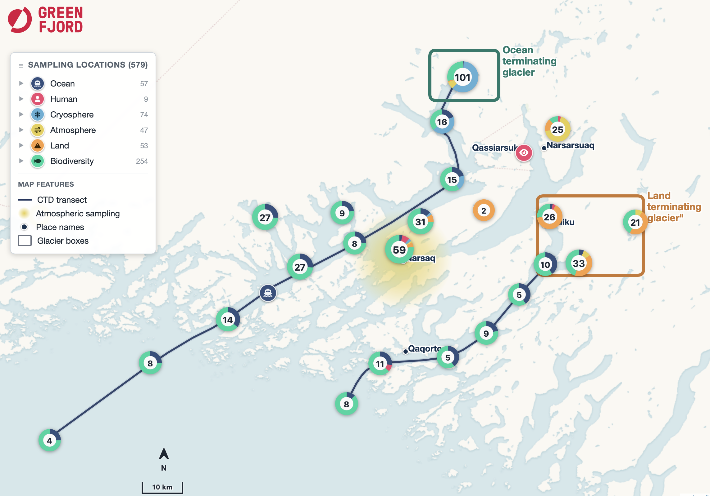

# GreenFjord sample map


Interactive map of sampling locations and selected metadata from the
[GreenFjord Project](https://greenfjord-project.ch/) in South Greenland.

- [Open the map on GitHub Pages](https://lukegre.github.io/greenfjord-sample-map/)
- [GreenFjord publications](https://greenfjord-project.ch/publications/)



## How it works

The map is generated from the local
[`data/sample_locations_merged.csv`](data/sample_locations_merged.csv) dataset
and [`src/sample_loc_map/config.yml`](src/sample_loc_map/config.yml). A Python
script cleans and packages the data into a single Leaflet HTML page at
[`docs/index.html`](docs/index.html).

The generated map includes:

- themed sample markers and donut clusters;
- expandable legend filters for research themes and sample types;
- configurable cluster spiderfying at close zoom levels;
- CTD cruise tracks for EKAS and Igaliku fjords;
- an atmospheric-sampling overlay;
- towns, glacier context boxes, basemap switching, and fullscreen support;
- draggable legend and north-arrow/scale-bar controls; and
- an optional live viewport BBOX readout in west, south, east, north order.

## Build locally

The project requires Python 3.11 or newer and uses
[uv](https://docs.astral.sh/uv/) for its environment.

```bash
uv sync
uv run sample-loc-map
```

This regenerates `docs/index.html`. To write to a temporary file instead:

```bash
uv run sample-loc-map --out /tmp/greenfjord-index.html
```

Open the resulting HTML in a browser. The page needs internet access for map
tiles and its Leaflet, marker-cluster, and Font Awesome assets.

## Make changes

- Edit `src/sample_loc_map/config.yml` for colors, labels, basemaps, initial
  view, markers, cluster behavior, towns, glacier boxes, overlays, logo, and
  cruise tracks.
- Edit `data/sample_locations_merged.csv` to change the plotted samples.
- Edit `src/sample_loc_map/build_map.py` when map behavior or the generated
  HTML/CSS/JavaScript needs to change.
- Do not edit `docs/index.html` by hand; regenerate it from the source files.

See
[`src/sample_loc_map/BUILD_NOTES.md`](src/sample_loc_map/BUILD_NOTES.md) for
the data flow, configuration reference, validation commands, and implementation
details.

## Deployment

Pushes to `main` run
[`run-sample-loc.yml`](.github/workflows/run-sample-loc.yml). The workflow
rebuilds `docs/index.html`, commits it if necessary, and deploys the `docs/`
directory to GitHub Pages.
